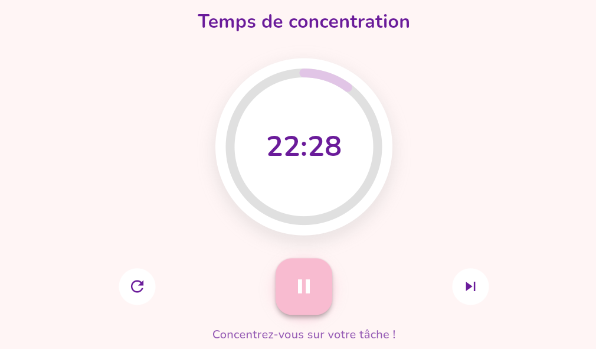

# Timer Pomodoro basique

## Description
Application mobile simple de **timer Pomodoro** permettant de gérer des sessions de travail de 25 minutes.  
Ce projet est le **deuxième** du défi personnel **100 projets en 2026**, dont l’objectif est de progresser par la pratique et la constance.

---

## Objectifs du projet
- Implémenter un compte à rebours fonctionnel
- Comprendre la gestion du temps et des états (actif, pause, réinitialisé)
- Mettre à jour l’interface utilisateur en temps réel
- Concevoir une UI claire et minimaliste

---

## Plateforme
- Mobile 
- Développée avec **Flutter**

---

## Technologies utilisées
- Flutter
- `dart:async` (Timer)
- Gestion d’état avec `setState`

---

## Fonctionnalités
- Timer Pomodoro de 25 minutes
- Bouton **Démarrer**
- Bouton **Pause**
- Bouton **Réinitialiser**
- Affichage du temps restant en temps réel
- Utilisation hors ligne

---

## Design & UX
- Interface minimaliste et apaisante
- Design féminin doux et moderne
- Un seul écran pour une concentration maximale

---

## Captures d’écran

---

## Ce que j’ai appris
- Utilisation des timers en Dart
- Gestion des états temporels
- Mise à jour dynamique de l’UI Flutter
- Organisation simple du code

---

## Améliorations possibles
- Choix de la durée des sessions
- Notifications de fin de session
- Mode pause longue
- Historique des sessions

---

## Statut du projet
   **Projet terminé**